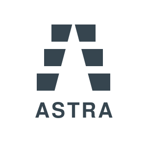

# ASTRA: The Code Intelligence App

**By Siestra**

# 🌌 ASTRA: Abstract Syntax Tree Risk Analyzer

   

> _The "F-16 Fighter Jet" of Static Analysis._ It doesn't just read your code; it understands the _cost_ and _risk_ of every line.



## Why ASTRA?

Most static analysis tools are dumb. They grep for strings. ASTRA builds a complete semantic graph of your entire software architecture to answer the questions that matter to CTOs and Lead Devs:

- **☢️ Blast Radius**: If I touch `utils.rs`, how many files break? (Impact Analysis)
- **🧟 Zombie Code**: What code are we paying to maintain that is _never called_? (Efficiency)
- **🎯 The Spotlight**: Don't fix everything. Fix the Top 3 files that matter (Churn + Risk).
- **📝 Maintenance Grade**: A simple A-F grade for your project's health. Not fake money.
- **🧠 Neural Interface**: Interactive D3.js visualization of your code's brain.

### Supported Languages (v2.0.0)

ASTRA Hyper-Intelligence Engine currently supports deep semantic analysis for:

| Tier 1 (Systems) | Tier 2 (Web)      | Tier 3 (Config) |
| :--------------- | :---------------- | :-------------- |
| 🦀 **Rust**      | 🟦 **TypeScript** | 📜 **JSON**     |
| 🐍 **Python**    | 🟨 **JavaScript** | 📄 **YAML**     |
| 🐹 **Go**        | ☕ **Java**       | 🐚 **Bash**     |
| ⚡ **C++**       | ⚛️ **HTML/CSS**   | 🐘 **Kotlin**   |

_(Tier 4 support for C#, Ruby, Swift, PHP, Solidity, and SQL arriving in v2.1)_

## Features & Pricing

| Feature                         | Indie (Free / $4.99) | Pro ($14.99) |
| :------------------------------ | :------------------: | :----------: |
| **Basic Audit**                 |          ✅          |      ✅      |
| **Zombie Code Detection**       |          ✅          |      ✅      |
| **Maintenance Grades (A-F)**    |          ✅          |      ✅      |
| **The Spotlight (Top 3)**       |          ✅          |      ✅      |
| **Deep Semantics (12 Langs)**   |          ✅          |      ✅      |
| **Git Forensics (The Prophet)** |          ❌          |      ✅      |
| **The Holodeck (3D Report)**    |      🔒 Locked       |      ✅      |
| **The Gatekeeper (CI/CD)**      |      🔒 Locked       |      ✅      |
| **The Purist (AST Complexity)** |      🔒 Locked       |      ✅      |
| **The Doppelgänger (Dupes)**    |      🔒 Locked       |      ✅      |
| **The Time Machine (Trends)**   |      🔒 Locked       |      ✅      |
| **The Cortex (Local AI)**       |      🔒 Locked       |      ✅      |
| **The Architect (AI Reports)**  |      🔒 Locked       |      ✅      |

---

## Installation

ASTRA is a standalone CLI application. It runs locally on your machine—your code never leaves your computer.

### Quick Install (Mac / Linux / Windows)

One command to rule them all. Detects your OS, verifies architecture, and automatically builds from source if a pre-compiled binary is incompatible.

**Linux / macOS**
```bash
curl -fsSL https://raw.githubusercontent.com/DrSkyle/ASTRA-Releases/main/install.sh | sh
```
*Supports: x86_64, aarch64 (M1/M2/M3), ARMv7*

**Windows (PowerShell)**
```powershell
iwr https://raw.githubusercontent.com/DrSkyle/ASTRA-Releases/main/install.ps1 -useb | iex
```

### Build from Source

This repository contains only binary releases. The source code is hosted privately.
If you have access, you can clone it from:

```bash
git clone git@github.com:DrSkyle/ASTRA.git
```

### Uninstall

To remove ASTRA from your system:

```bash
# Linux / macOS
rm ~/.local/bin/astra /usr/local/bin/astra 2>/dev/null

# Windows (PowerShell)
rm $env:LOCALAPPDATA\Siestra\ASTRA\astra.exe
```

---

## Usage

### 1. Scan Your Code

Go to any project folder and run:

```bash
astra scan
```

This will generate a quick terminal summary of your project's health using the **Spotlight Engine**.

### 2. Upgrade to Pro

To unlock the **Neural Interface** and **Executive Report**, buy a license:

```bash
astra buy
```

### 3. Ask The Oracle

```bash
astra ask "Why is the Maintenance Grade only a C?"
```

### 4. The Architect (AI Executive Summary)

Automatically embedded in the HTML report when Ollama is active.

```bash
astra scan --html
```

### 5. Generate Holodeck Report ("Genius Mode")

Visualize your codebase as a 3D neural network. Files that change often and are complex will **pulse red** (Hotspot Analysis):

```bash
astra scan --html --output report.pdf
```
_Opens `astra-report.html` in your browser._

### 6. Set up CI/CD ("The Gatekeeper")

Generate a GitHub Actions workflow to auto-fail builds if risk is too high:

```bash
astra init
```

Now you can generate the "Future-Glass" dashboard:

```bash
astra scan --output ./report.html
```

Open `report.html` in your browser to see your Neural Interface.

---

## License

Copyright © 2025 Siestra. All Rights Reserved.
Powered by Freemius.
